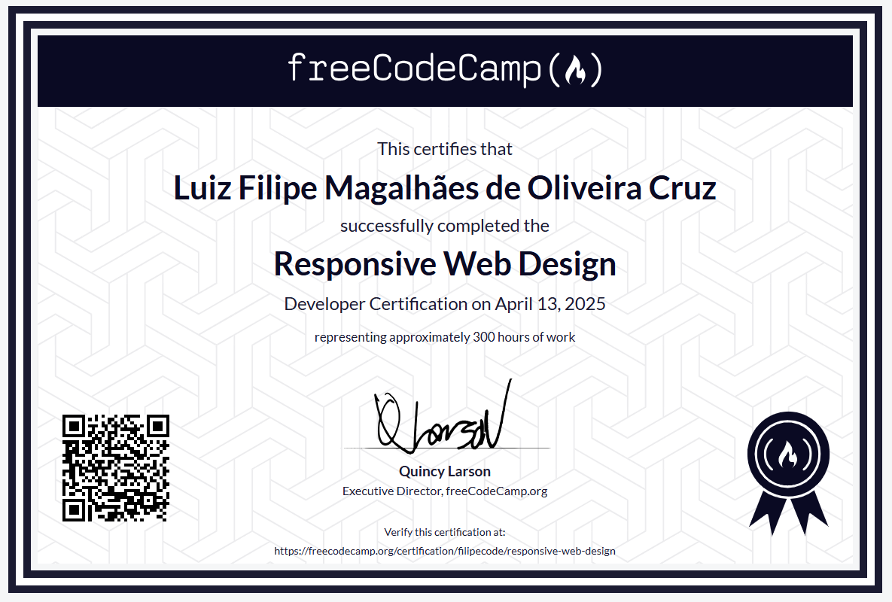

    

 

This repository is dedicated to storing all the codes, projects, and certifications I have earned during my learning journey on <a href="https://www.freecodecamp.org/">freeCodeCamp</a>. Here, you will find an organized collection of exercises and projects developed throughout the courses offered by the platform.

---

## 🏫 About freeCodeCamp

<a href="https://www.freecodecamp.org/">freeCodeCamp</a> is a nonprofit educational organization that provides an interactive learning platform for people around the world who want to learn to code. Founded by Quincy Larson in 2014, freeCodeCamp's mission is to make software development education accessible to everyone, regardless of location or financial situation.

The platform offers a variety of free courses, covering topics such as web development, data science, machine learning, and more. Additionally, freeCodeCamp encourages students to contribute to open source projects for nonprofits, providing hands-on experience in software development.

## 🏆 Certifications

As I progress through freeCodeCamp courses, I earn certifications that prove the knowledge I've acquired. Each certification is accompanied by a series of practical projects that demonstrate the skills I've developed.

### 📜 Responsive Web Design

    

 

### Projects

- [Cafe Menu](https://filipecode-03.github.io/cafemenu/index.html)
- [Form](https://filipecode-03.github.io/form/index.html)
- [Survey Form](https://filipecode-03.github.io/surveyForm/index.html)
- [Flexbox photo gallery](https://filipecode-03.github.io/flexboxphotogallery/index.html)
- [Questionnaire](https://filipecode-03.github.io/questionnaire/index.html)
- [Tribute Page](https://filipecode-03.github.io/tributePage/index.html)
- 
- 
- 
- 

 

---

 

This repository is a demonstration of my ongoing commitment to learning and practicing software development. I am grateful to freeCodeCamp for providing free, high-quality educational resources to the global community.

> "Learning is a treasure that will follow its owner everywhere." – Chinese Proverb